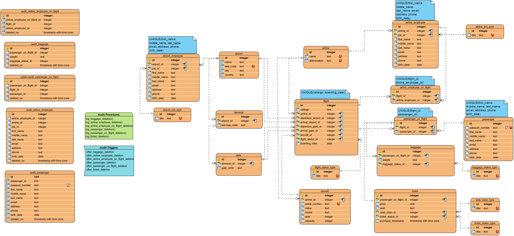

## CS3630 S20 - Course Project - Team_01

*See the 'documentation/Project_Rubric.pdf' file for information on what we were assigned.*

**Project Description**
Airport Management System. Utilizes a database to record and track entities related to airports such as aircrafts, employees, flights, as well as passengers and their belongings.

**Running and Development**
See the 'documentation/DEVELOPMENT_ENVIRONMENT.md' file.
	
**Authors**
Ross Baldwin, Austin FitzGerald, Zexin/Jason Liu

----------------------------------------------------------------------------

Our database design is not the best, but it was a learning experience. It is definitely stuck in the second normal form, and the passenger_on_flight table should be consolidated with the ticket table. Live and learn.